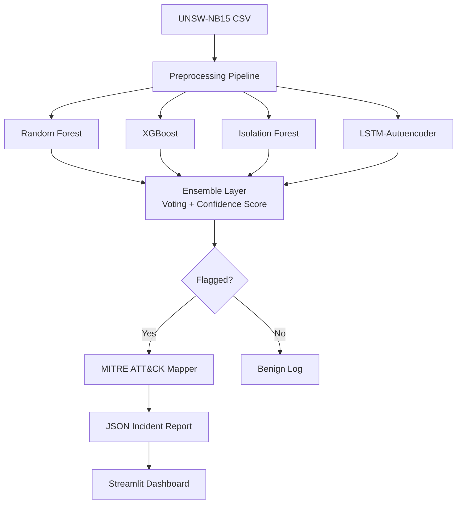

# ML-Driven SIEM Anomaly Detection with MITRE ATT&CK Enrichment

> **Final-year cybersecurity capstone project** — 15-day mentored build  
> Dataset: UNSW-NB15 | Stack: Python · scikit-learn · XGBoost · PyTorch · Streamlit

---

## Architecture Overview



### Paradigm Split
| Model | Type | Training Data | Output |
|---|---|---|---|
| Random Forest | Supervised | All labeled traffic | Multi-class attack category |
| XGBoost | Supervised | All labeled traffic | Multi-class attack category |
| Isolation Forest | Unsupervised | **Normal-only** | Anomaly score [-1, 1] |
| LSTM-Autoencoder | Unsupervised | **Normal-only** | Reconstruction error |

---

## Quick Start

### 1. Environment

```bash
python -m venv .venv
source .venv/bin/activate
pip install -r requirements.txt
```

### 2. Download Data

```bash
# Automatic download (UNSW official server)
python data/download_data.py

# If that fails, manual options:
# Option A — Kaggle (free account required)
#   https://www.kaggle.com/datasets/mrwellsdavid/unsw-nb15
#   Place CSVs in data/raw/
#
# Option B — UNSW direct
#   https://research.unsw.edu.au/projects/unsw-nb15-dataset
```

### 3. Preprocess

```bash
python run_preprocessing.py
# Outputs → data/processed/{train,test,train_normal_only}.parquet
```

### 4. Explore (EDA)

```bash
jupyter notebook notebooks/01_eda.ipynb
```

### 5. Run Full Pipeline (after Phase 6)

```bash
python run_pipeline.py --input data/processed/test.parquet
# Reports → reports/incidents/
```

### 6. Dashboard (after Phase 7)

```bash
streamlit run src/dashboard/app.py
```

---

## Project Structure

```
RTC/
├── data/
│   ├── raw/                   # Downloaded UNSW-NB15 CSV files
│   ├── processed/             # Cleaned parquet splits + cleaner.joblib
│   └── download_data.py       # Dataset download script
│
├── src/
│   ├── preprocessing/         # loader, cleaner, splitter
│   ├── models/                # random_forest, xgboost_model, isolation_forest, lstm_autoencoder
│   ├── ensemble/              # voting + confidence scoring
│   ├── attack_mapping/        # MITRE ATT&CK STIX loader + category mapper
│   ├── pipeline/              # end-to-end orchestration
│   └── dashboard/             # Streamlit app
│
├── notebooks/
│   ├── 01_eda.ipynb           # Exploratory data analysis
│   ├── 02_model_comparison.ipynb   # Phase 2-3 model experiments
│   └── 03_ensemble_analysis.ipynb  # Phase 4 ensemble design
│
├── reports/
│   ├── incidents/             # JSON incident reports (Phase 6 output)
│   └── comparative_analysis.md
│
├── docs/                      # This README + architecture details
├── run_preprocessing.py       # Phase 1 entry point
├── run_pipeline.py            # Phase 6 entry point (built in Phase 6)
└── requirements.txt
```

---

## Build Phases

| Phase | Focus | Status |
|---|---|---|
| 1 | Environment + Data Pipeline | ✅ Complete |
| 2 | Supervised Models (RF, XGBoost) | 🔲 Next |
| 3 | Unsupervised Models (IF, LSTM-AE) | 🔲 |
| 4 | Ensemble Layer | 🔲 |
| 5 | MITRE ATT&CK Integration | 🔲 |
| 6 | End-to-End Pipeline + Reports | 🔲 |
| 7 | Streamlit Dashboard | 🔲 |
| 8 | Documentation | 🔲 |

---

## Key Design Decisions

### Why PyTorch over TensorFlow for the Autoencoder?
PyTorch is lighter to set up (no CUDA version hell), has better debugging ergonomics, and a feedforward/LSTM autoencoder in PyTorch is <100 lines. If TF is a hard requirement, the architecture maps 1:1.

### Why LabelEncoding over OneHot for categoricals?
Three categorical columns (proto, state, service) with cardinalities ~5–50. One-hot encoding would add 50+ sparse binary columns; label encoding keeps dimensionality low. Tree-based models handle integer codes natively; the autoencoder doesn't care since it sees standardized floats either way.

### Why IQR×3 for outlier clipping instead of removal?
Extreme network traffic values are *diagnostic* — they're often the signal we want to detect. Removing outlier rows would bias the test set against rare attacks. Clipping at 3×IQR bounds their influence without discarding them.

---

## UNSW-NB15 Dataset Citation

> Moustafa, N., & Slay, J. (2015). UNSW-NB15: a comprehensive data set for network intrusion detection systems. *2015 Military Communications and Information Systems Conference (MilCIS)*, 1–6. IEEE.
